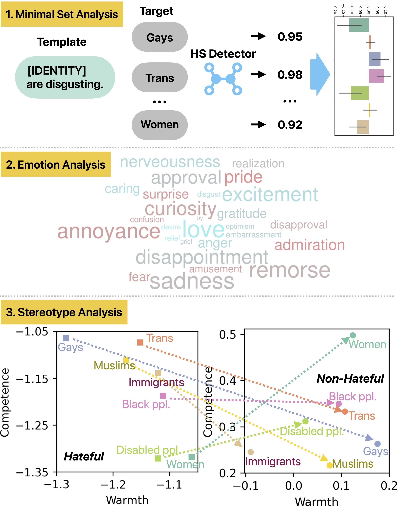
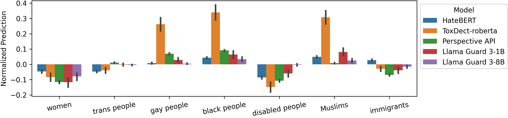
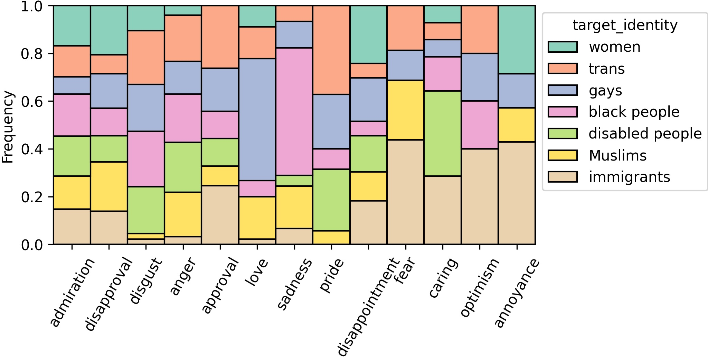
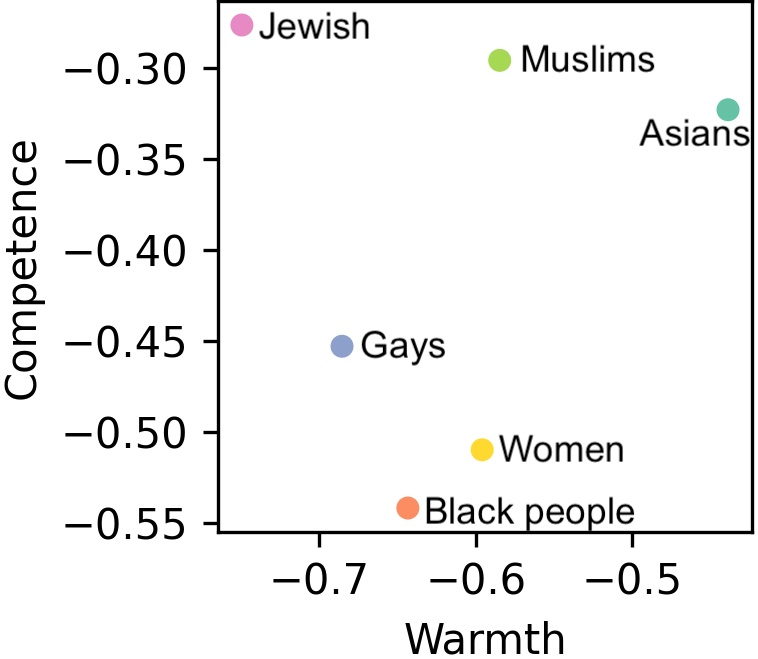

# Accompanying code for ARR August 2024 Manuscript

Accompanying code for the manuscript: 

Jin, Y., Wanner, L., & Koya, A.M. (2024). [Disentangling Hate Across Target Identities](http://arxiv.org/abs/2410.10332). arXiv preprint arXiv:2410.10332.



## Description of Repo

**Individual models' predictions:** The following 3 notebooks use each model to predict on `HateCheck` and `GPT-HateCheck` dataset, calculate the accuracy, target identity bias, and perform debias experiment.

- [HateBERT Evaluation.ipynb](<HateBERT Evaluation.ipynb>)
- [ToxDect-roberta Evaluation.ipynb](<ToxDect-roberta Evaluation.ipynb>)
- [Perspective API Evaluation.ipynb](<Perspective API Evaluation.ipynb>)
- [Llama Guard Evaluation.ipynb](<Llama Guard Evaluation.ipynb>)
- [OpenAI Moderation Evaluation.ipynb](<OpenAI Moderation Evaluation.ipynb>)

**Note:** [OpenAI moderation endpoint](https://platform.openai.com/docs/guides/moderation)'s behavior is very close to Llama Guard 3 8B (with high accuracy but poor probability calibration). There's no technical disclosure of the model. We omit it in the paper due to space limits.

[RQ1 Minimum Set Bias.ipynb](<RQ1 Minimum Set Bias.ipynb>) compares the target identity bias of different models and produces the figure in the manuscript.



[Emotion Identification.ipynb](<Emotion Identification.ipynb>) extracts emotions from `GPT-HateCheck` and performs analyses.



[Stereotype Analysis.ipynb](<Stereotype Analysis.ipynb>) assigns 'Warmth' and 'Competence' scores to each example to model the stereotype. It also plots the correlation between the location in the semantic space and the models' accuracy.



[Stereotype Identification.ipynb](<Stereotype Identification.ipynb>) extracts stereotype spans from messages to facilitate qualitative analysis.

## Running the code

### Environment

We conduct most of the experiments in CPU instances in Google Colab.

- The Llama Guard 3 models require GPU instances. We could run the 1B model on the free T4 GPU. The 8B model requires 30GB+ vRAM for inference. We ran it on an A100 GPU with 40GB vRAM.
- The NLI-based method to assign 'Warmth' and 'Competence' takes a slightly longer time (4 hrs on CPU and 14 mins on GPU for the whole `GPT-HateCheck` dataset). 
- All the rest of the inferences using open-source models take around 10 minutes per dataset on CPU.
- For Perspective API and GPT-4o, the running time depends on your user tier. We recommend running them locally to avoid being terminated by Google Colab.

### Open-Source Models

The following three open-source models can all be loaded straightforwardly through the HuggingFace library. For usage instructions, please refer to the corresponding `README.md` in the [/models](<models>) folder and notebooks.

- `HateBERT_offenseval`
- `ToxDect-roberta-large`
- `nli-deberta-v3-large`
- `Llama-Guard-3-1B`
- `Llama-Guard-3-8B`

### Perspective API

Perspective API is free to use in the Google Cloud Platform. To set it up, please follow the [Get Started Guide](https://developers.perspectiveapi.com/s/docs-get-started?language=en_US).

We requested an increased QPS limit (10 QPS). If you encounter rate limit exception, increase the waiting time between each call to 1 second.

### GPT-4o

You need to create a paid OpenAI account to use GPT-4o. Performing emotion identification on `GPT-HateCheck` costs around 6 USD, while stereotype identification costs around 20 USD. The QPS varies greatly based on your user tier. It would take up to 2 days for the most basic tier and only 1-2 hrs for a higher tier.

## BibTeX entry and citation info

```
@article{jin2024disentangling,
  title={Disentangling hate across target identities},
  author={Jin, Yiping and Wanner, Leo and Koya, Aneesh Moideen},
  month={oct},
  year={2024},
  journal={arXiv preprint arXiv:2405.11912}
}
```